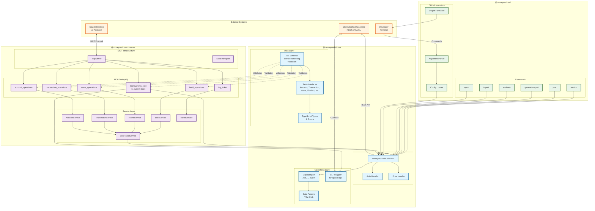

# MoneyWorks Core Architecture: Core, MCP, and CLI

## Overview

This document describes the relationship between the three main packages in the MoneyWorks ecosystem:
- **@moneyworks/core**: The foundational TypeScript library
- **@moneyworks/mcp-server**: Model Context Protocol server for AI assistants
- **@moneyworks/cli**: Command-line interface for developers

## Architecture Diagram



## Package Relationships

### 1. @moneyworks/core (Foundation Layer)

The core package provides the fundamental building blocks:

- **REST Client**: Handles all HTTP communication with MoneyWorks Datacentre
- **Type System**: Strongly-typed interfaces for all MoneyWorks tables
- **Schemas**: Zod schemas for runtime validation and self-documentation
- **Data Conversion**: XML ↔ JSON conversion with type safety
- **CLI Wrapper**: Executes MoneyWorks CLI for operations not in REST API

**Key exports**:
```typescript
// Main client
export { MoneyWorksRESTClient } from "./rest";

// Table types
export * from "./tables";

// Schemas for validation
export * from "./schemas";

// CLI wrapper for special operations
export { MoneyWorksCLI } from "./cli/wrapper";
```

### 2. @moneyworks/mcp-server (AI Integration Layer)

The MCP server exposes MoneyWorks functionality to AI assistants:

- **Service Layer**: Wraps core REST client with business logic
- **45 MCP Tools**: 4 table tools + 41 system tools
- **Error Tracking**: SQLite-based ticket system for improvements
- **Type Safety**: Uses core schemas for parameter validation

**Architecture**:
```
Claude Desktop → MCP Protocol → MCP Server → Service Layer → Core REST Client → MoneyWorks
```

**Tool Categories**:
- Table Operations (4): account, transaction, name, build
- System Operations (41): validation, permissions, calculations, etc.
- Error Tracking (1): log_ticket for continuous improvement

### 3. @moneyworks/cli (Developer Interface Layer)

The CLI provides command-line access to MoneyWorks:

- **Direct REST Access**: Uses core REST client
- **Developer-Friendly**: Commands map to common operations
- **Flexible Output**: JSON, XML, TSV formats
- **Streaming Support**: For large datasets

**Command Flow**:
```
Developer → CLI Command → Argument Parser → Core REST Client → MoneyWorks
```

## Data Flow Examples

### Example 1: AI Assistant Queries Accounts
```
1. Claude Desktop: "Show me all bank accounts"
2. MCP Server: Receives tool call for account_operations
3. AccountService: Builds filter "Type='BA'"
4. Core REST Client: GET /REST/.../export?table=Account&filter=Type="BA"
5. MoneyWorks: Returns XML data
6. Core Parser: Converts XML to JSON with types
7. MCP Server: Returns formatted JSON to Claude
```

### Example 2: Developer Exports Transactions
```
1. Developer: mw export Transaction --limit 100 --format json
2. CLI Parser: Parses arguments and options
3. Core REST Client: GET /REST/.../export?table=Transaction&limit=100
4. MoneyWorks: Returns XML data (limited to 100)
5. Core Parser: Converts to JSON array
6. CLI Output: Prints JSON to stdout
```

### Example 3: Complex Calculation via MCP
```
1. Claude: Uses moneyworks_core tool with calculation operation
2. MCP Server: Routes to calculation handler
3. Core CLI Wrapper: Executes MoneyWorks CLI for evaluate
4. MoneyWorks CLI: Evaluates expression
5. Results flow back through the stack
```

## Key Design Principles

1. **Separation of Concerns**:
   - Core: Pure data access and types
   - MCP: AI-specific adapters and tools
   - CLI: Developer-specific commands

2. **Type Safety Throughout**:
   - TypeScript interfaces in core
   - Zod schemas for runtime validation
   - Type narrowing at boundaries

3. **Reusability**:
   - Core package used by both MCP and CLI
   - Shared schemas ensure consistency
   - Common error handling patterns

4. **Progressive Enhancement**:
   - Core provides low-level access
   - Services add business logic
   - Tools/Commands add use-case specific features

## Configuration Flow

```
mw-config.json
    ↓
┌─────────────┬─────────────┬──────────────┐
│     CLI     │  MCP Server │   Core       │
│ (uses core) │ (uses core) │ (base config)│
└─────────────┴─────────────┴──────────────┘
```

All three packages share the same configuration format, ensuring consistency across different access methods.

## Future Extensibility

The architecture supports future additions:
- New table types: Add to core → Available everywhere
- New MCP tools: Add to MCP server → Available to AI
- New CLI commands: Add to CLI → Available to developers
- New export formats: Add to core → Available everywhere

This modular approach ensures that improvements in one area benefit the entire ecosystem.