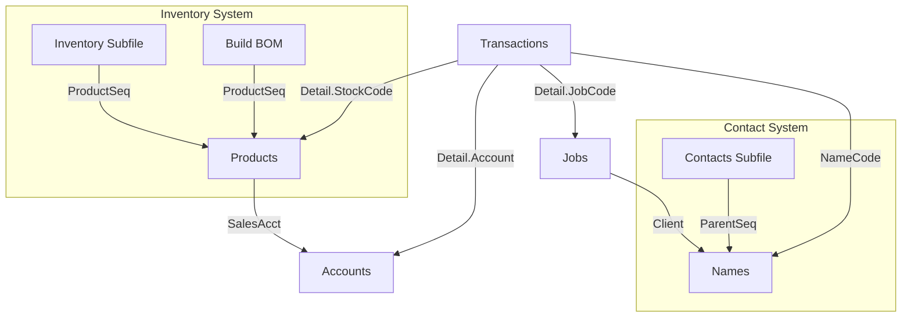

# MoneyWorks Data Architecture: The Entity Graph

This document maps the foreign key relationships between the core MoneyWorks entities. Understanding these links is critical for writing correct SQL queries, Scripts, and API calls.

## 1. The Central Hub: "Names"
The `Names` entity (Customers & Suppliers) is the center of the universe.

*   **Transactions** -> `NameCode` links to `Names.Code`.
*   **Jobs** -> `Client` links to `Names.Code`.
*   **Contacts** -> `ParentSeq` links to `Names.SequenceNumber`.
*   **Payments** -> `InvoiceID` (Negative) links to `Names.SequenceNumber` (Overpayments).

## 2. The Product/Inventory Cluster
*   **Transactions (Detail)** -> `StockCode` links to `Products.Code`.
*   **Inventory** -> `ProductSeq` links to `Products.SequenceNumber`.
*   **Build Records** -> `ProductSeq` links to `Products.SequenceNumber`.
*   **Build Records** -> `PartCode` links to `Products.Code`.

## 3. The Financial Backbone (GL)
*   **Transactions (Detail)** -> `Account` links to `Accounts.Code`.
*   **Ledger** -> `AccountCode` links to `Accounts.Code`.
*   **Products** -> `SalesAcct`, `COGAcct`, `StockAcct` link to `Accounts.Code`.
*   **TaxRates** -> `PaidAccount`, `RecAccount` link to `Accounts.Code`.

## 4. Sequence Numbers vs Codes
MoneyWorks uses two types of keys. It is vital to know which one a relationship expects.

### Type A: The "Code" Link (User Facing)
Most relationships use the alphanumeric Code.
*   *Advantage*: Human readable ("CUST01", "4000").
*   *Examples*: `Transaction.NameCode`, `Detail.Account`, `Product.Category`.

### Type B: The "Sequence" Link (Internal ID)
Subfiles and Junction tables often use the immutable integer Sequence Number.
*   *Advantage*: Faster, handles renaming of parent codes.
*   *Examples*: `Inventory.ProductSeq`, `Contacts.ParentSeq`, `Payments.CashTrans`.

> **Developer Rule**: If the field name ends in `Code` or is just the entity name (e.g. `Account`), it likely takes a string. If it ends in `Seq`, `ID`, or `Trans`, it takes an Integer.

## 5. Visual Hierarchy

